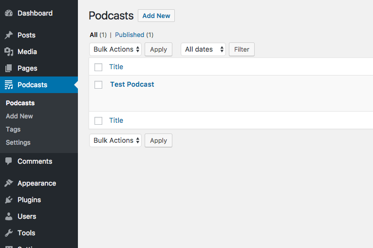
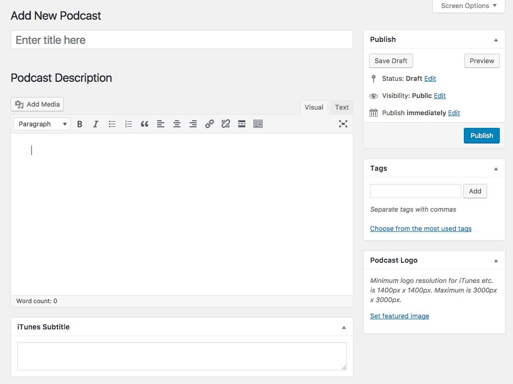
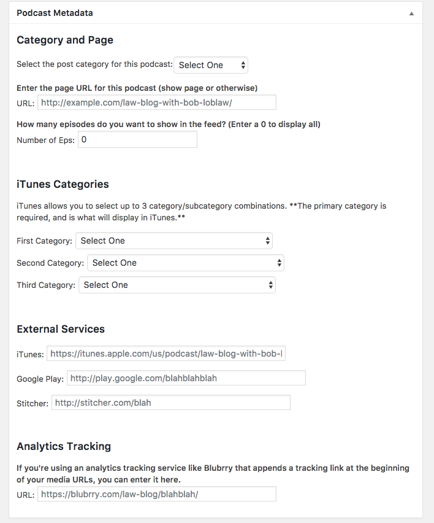
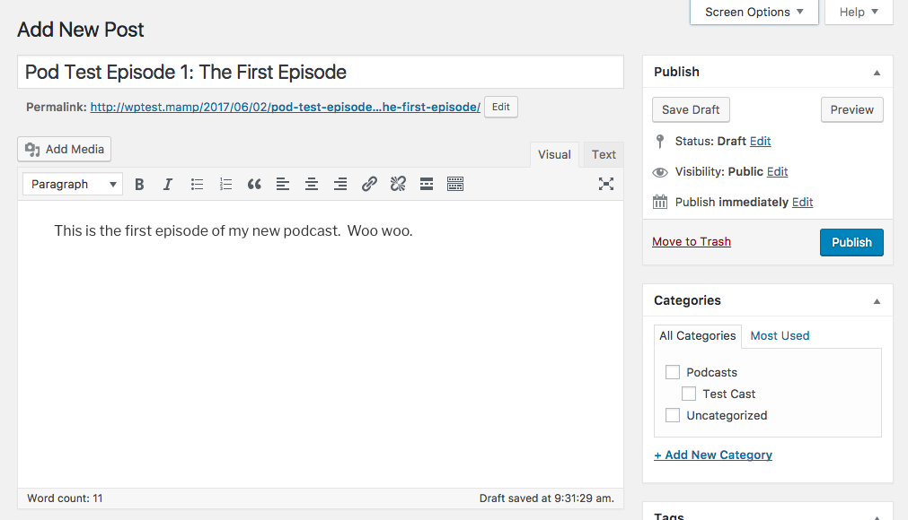
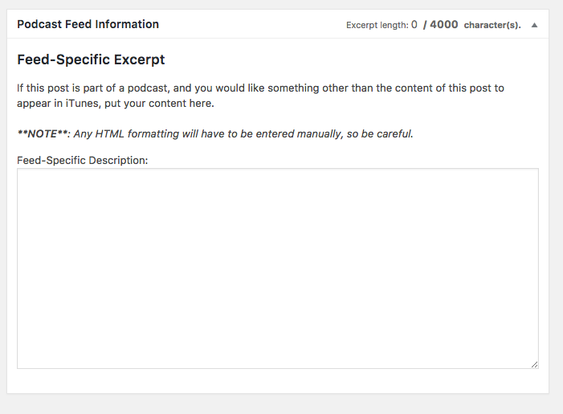
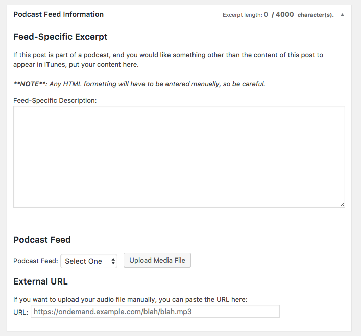

# Podcasts by Category

A Wordpress plugin that allows you to create a podcast feed from any category. It periodically generates the feeds and saves them as site options. It can also upload your media files to an SFTP server.

## Why does this exist?

I couldn't find a podcasting plugin that functioned how I wanted, so I made one myself.

I also wanted to learn some of the ins and outs of creating a Wordpress plugin, and this seemed like a perfect way to learn.

## Getting started

Download this repo, unzip it, and drop the `hpm-podcasts` folder into your wp-content/plugins folder. Then log into your site, go to the Plugins area and activate it.

Once it is activated, look for Podcasts in the left-hand menu of the Admin Dashboard. If you are logged in as an admin, you will see `Settings` listed in that section. From there, you can set up the owner of the podcast, how frequently the feeds are updated, and all of your upload options.

If you aren't comfortable adding your SFTP password to your database, you can always set them as variables in your Wordpress configuration. Add the following lines (where applicable) to `wp-config.php`:
```
define( 'HPM_SFTP_PASSWORD', 'YOUR_SFTP_PASSWORD' );
```

If you want to define these keys as environment variables (for example, if you're running this site on Amazon Elastic Beanstalk or the like), you can include these definitions in your `wp-config.php` file with references to your environment:

```
define( 'HPM_SFTP_PASSWORD', $_SERVER['HPM_SFTP_PASSWORD'] );
```

## Your Podcast Feeds

You create them in much the same way as you would create a page or post. Start by finding the 'Podcasts' menu in the left-hand menu in the admin dashboard.



All of your podcast feeds will be listed in the order that they were created, just like posts. Click 'Add New' to create a new feed.

The editor is the same as your normal post editor, though several of the fields have been renamed ('Excerpt' becomes 'iTunes Subtitle', 'Featured Image' becomes 'Podcast Logo', etc.). The tags are included in the feed and are useful for search in iTunes, Google Play, etc.



The real fun starts in the box called `Podcast Metadata` (catchy, I know). That is where you select what post category you want to be included in your podcast, where the episode archive resides, how many episodes to include in the feed, etc. You can also select your categories for iTunes. Note that they are displayed in your feed in order, and the first one is the default category in which your podcast will appear.



Once your podcast is set up and has been submitted to iTunes, Google Play, etc., you can enter the URLs here, which will show up on the archive page.

You can also define analytics pass-through URLs you want to use (if you're using Blubrry or the like).


## Creating Episodes

Create a post, add it to the category you selected when setting up your podcast feed, and either attach your audio file to the article, or insert it from the Media Library.

Tags and the featured image (if you have it enabled in your theme) will be attached to the episode in your feed, if present.



You can create a description for your episode that is specific to your podcast feed in the box marked `Podcast Feed Information`. This way, you can post a full-sized article on your site but still be concise in the episode description on whatever podcast platform it's being viewed on. If this isn't set, the feed will pull the first 75 words or so and create the description out of that. iTunes limits this description to 4000 characters, which includes any HTML you might enter.



If you have enabled media file uploading, a couple of other options will show up below the Excerpt box.



Select the name of the feed from the dropdown to which this episode belongs, and click "Upload Media File". The feed dropdown is mainly used to help organize your files on the remote server (i.e. the files for 'Test Podcast' will be stored in a `/test-podcast/` folder on the remote server).

As the upload progresses, you will receive updates until the process is either completed successfully or fails. If successful, it will also update the External URL field below. If you don't want to rely on the uploader, you can manually upload the file to your remote server and enter the URL.

## Customizing Your Podcasts or Archive Listing

If you want to customize the podcast archive listing, you can do so by creating a folder in your theme called `podcasts` and saving your `archive.php` template file in there. You can also do that with `single.php`, but there isn't much you can change on that at the moment.

## Wishlist

This project is a work in progress. If you have ideas or run into problems, open an issue!

## Questions

Contact me at jcounts@houstonpublicmedia.org.

## License

Copyright (c) 2018 Houston Public Media

Permission is hereby granted, free of charge, to any person obtaining a copy of this software and associated documentation files (the "Software"), to deal in the Software without restriction, including without limitation the rights to use, copy, modify, merge, publish, distribute, sublicense, and/or sell copies of the Software, and to permit persons to whom the Software is furnished to do so, subject to the following conditions:

The above copyright notice and this permission notice shall be included in all copies or substantial portions of the Software.

THE SOFTWARE IS PROVIDED "AS IS", WITHOUT WARRANTY OF ANY KIND, EXPRESS OR IMPLIED, INCLUDING BUT NOT LIMITED TO THE WARRANTIES OF MERCHANTABILITY, FITNESS FOR A PARTICULAR PURPOSE AND NONINFRINGEMENT. IN NO EVENT SHALL THE AUTHORS OR COPYRIGHT HOLDERS BE LIABLE FOR ANY CLAIM, DAMAGES OR OTHER LIABILITY, WHETHER IN AN ACTION OF CONTRACT, TORT OR OTHERWISE, ARISING FROM, OUT OF OR IN CONNECTION WITH THE SOFTWARE OR THE USE OR OTHER DEALINGS IN THE SOFTWARE.
